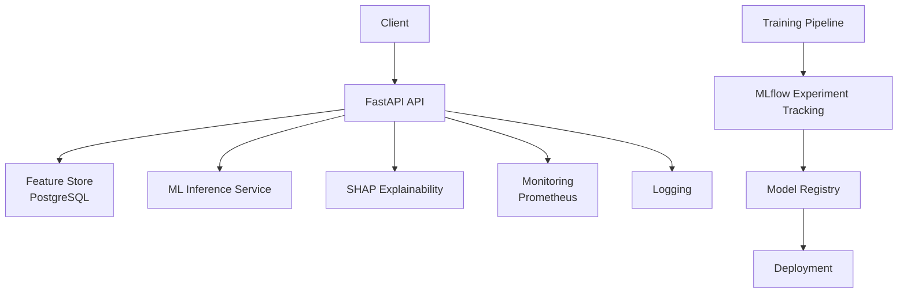

# CreditFlow AI

CreditFlow AI is a production-grade machine learning platform for real-time credit risk assessment, inspired by modern fintech lending systems such as Kredivo, Affirm, and Nubank.

Unlike traditional ML projects that stop at model training, this project demonstrates the complete lifecycle of deploying and operating machine learning systems in production. It combines machine learning, backend engineering, DevOps, and MLOps to deliver scalable, explainable, and monitored inference services.

## Features

- Real-time credit risk prediction using FastAPI
- End-to-end ML pipeline with feature engineering and model training
- Experiment tracking and model registry using MLflow
- Explainable AI with SHAP
- Automated retraining pipelines with Apache Airflow
- Feature and model drift monitoring using Evidently AI
- Production monitoring with Prometheus and Grafana
- PostgreSQL-backed feature storage
- Dockerized services with Kubernetes deployment
- CI/CD using GitHub Actions
- Comprehensive testing and production-ready project architecture

## Tech Stack

**Machine Learning**
- Python
- Scikit-learn
- XGBoost
- LightGBM
- SHAP

**Backend**
- FastAPI
- SQLAlchemy
- PostgreSQL

**MLOps**
- MLflow
- Evidently AI
- Airflow

**DevOps**
- Docker
- Kubernetes
- GitHub Actions
- Prometheus
- Grafana

## System Architecture

## Project Goals

This repository aims to demonstrate software engineering practices expected from Machine Learning Engineers working on production systems:

- Designing scalable ML services
- Building reliable APIs for model serving
- Automating model training and deployment
- Monitoring data quality and model performance
- Implementing explainable AI for financial decision-making
- Following production-grade software engineering and MLOps best practices

> **Status:** 🚧 Under active development as a portfolio project showcasing end-to-end Machine Learning Engineering and MLOps capabilities.
